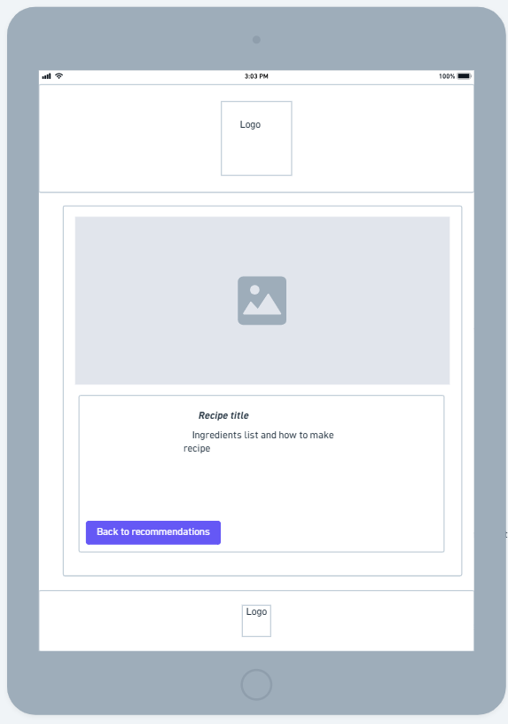
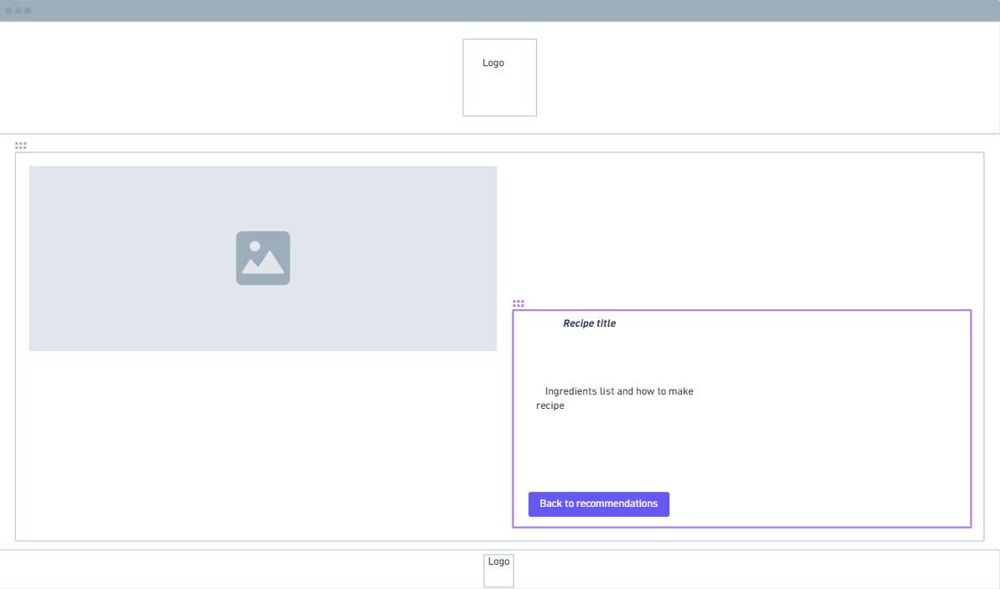
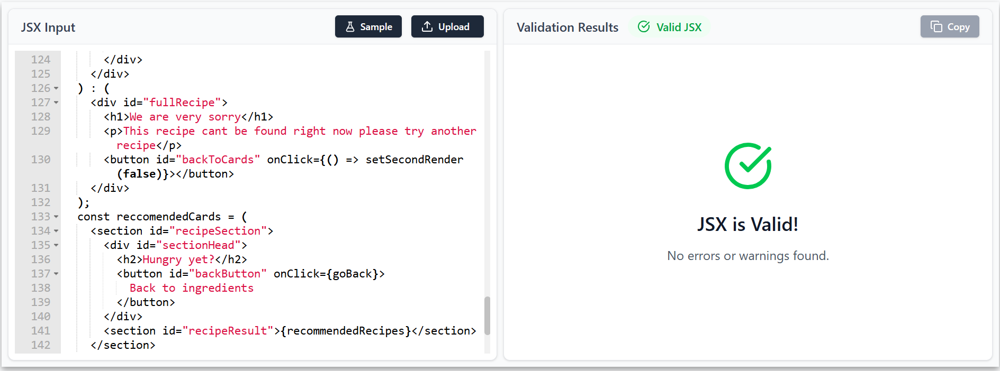
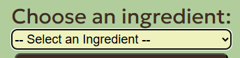
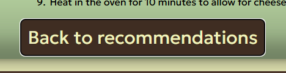

# Recipe-Rescue

---

[To view site](https://devildex91.github.io/recipe-rescue/)

## Table of Contents

## [UX](#ux-1)

[Primary Goals](#primary-goals)  
[Business Goals](#business-goals)  
[User Goals](#user-goals)  
[User Stories](#user-stories)  
[Design Choices](#design-choices)  
[Wireframes](#wireframes)

## [Features](#features-1)

[Existing features](#existing-features)  
[User Goals mapping](#user-goals-mapping)    
[Features left to implement](#features-left-to-implement)  
[User Goals still to implement](#user-goals-still-to-implement)  

## [Technologies used](#technologies-used-1)

## [Testing](#testing-1)

[Lighthouse tests](#lighthouse-tests)  
[HTML tests](#html-tests)  
[CSS tests](#css-tests)  
[JSX tests](#jsx-tests)  
[Contrast tests](#contrast-tests)  
[Keyboard Accessibility tests](#keyboard-accessibility-tests)  
[Development bugs and fixes](#development-bugs-and-fixes)  
[Cross browser testing](#cross-browser-testing)  
[User Testing](#user-testing)

## [Deployment](#deployment-1)

[How to run this project](#how-to-run-project)

## [Credits](#credits-1)
[Content/Media/Code/Acknowledgements](#contentmediacodeacknowledgements)  
[dependencies](#dependencies-for-reactvite)

### UX

---

#### Primary Goals

---

The primary goals of Recipe Rescue are:
 - To reduce food waste by providing our users with the opportunity to use food left available to them.
 - To provide a list of recipes that include as many of those ingredients as possible.
 - To reduce shopping bills and increase the money left available to the user.
 - To get people loving food again.
 - To get users trying new recipes they might not have thought about before.

[Back to top](#recipe-rescue)

#### Business Goals

---

The business goals of Recipe Rescue are:
- To simplify Meal discovery
- Optimise household budgets
- Maximise user acquisition by targeting budget conscious shoppers, students and home cooks.
- Long term business goals are to secure partnerships with major supermarkets to offer personalised shopping lists to your favourite Supermarkets.  

[Back to top](#recipe-rescue)

#### User Goals

---

The goals for users would be:
- Save money on their shopping
- Reduce Household waste
- Save time on meal planning
- Avoid last minute shopping trips by making the most of their ingredients.
- Clear cupboard of leftover ingredients
- Use foods close to expiry dates

[Back to top](#recipe-rescue)

#### User Stories

---

For full Acceptance Criteria and tasks please follow [this link](https://github.com/users/devildex91/projects/6/views/1?layout=board) to the project board for Recipe Rescue.

##### User Story 1-Responsive layout

As a first time visitor I would like it to be simple to use and follow to achieve a list of recipes.

##### Acceptance Criteria

- The website is responsive to whatever screen size is used to access it.
- The website clearly tells users what they need to do and makes it obvious.

##### Tasks

- Ensure all sections are easy to use and simple to follow.
- Apply a flexible layout so that it works on all screen sizes.

##### User-Story 2-Missing Ingredients

As a user, I want to see how many ingredients I am missing for a specific recipe, so that I can decide if it's worth a quick trip to the shop or if I should choose a different meal.

##### Acceptance-Criteria

- Each recipe card displays the missing ingredients.

##### Tasks

- Make sure the recipe card displays all the missing ingredients for each recipe.

##### User Story 3-Ingredient based Recipe Search

As a busy home cook I would like to input the ingredients I have left so I can find recipes I can make with minimal extra ingredients.

##### Acceptance Criteria

- Users can type and add multiple ingredients to search.
- The app returns a list of recipes that include as many of the ingredients available as possible.
- Each recipe must display a title, image and all the ingredients missing.

##### Tasks

- Build an input field to add ingredients too.
- Integrate a related API to handle recipe search.
- Design a recipe card to display the information from the API.

##### User Story 4-Dietary preference

As a user with specific dietary restrictions I want to filter my ingredient search results by diet or allergy, so that I only see recipes that are safe and appropriate for me to eat.

##### Acceptance Criteria

- Users can exclude specific ingredients
- Search results must update dynamically based on these filters
- A filter menu is accessible from the search screen

##### Tasks

- Create a settings component to filter ingredients
- Pass dietary parameters into the API search

##### User Story 5-User login

 As a user, I want my own login to see a history of my Recent Rescues, so that I can quickly find a recipe I looked at earlier in the day without re-entering my ingredients.

##### Acceptance Criteria

- Set up a login section for users.
- A Recently Viewed section appears on the menu of your home page when logged in.
- Clicking a recent item takes the user directly to that recipe's preview.

##### Tasks

- Set up a users login section to save their previous searches and recipes
- Build a horizontal scrolling component for the Recent list
- Implement a Clear History function within the app settings

##### User Story 6-Discovering recipes by Ingredients

As a busy home cook, I want to input the ingredients I already have so that I can find recipes without going to the grocery store.

##### Acceptance Criteria

- The system accepts a list of at least one ingredient.
- The system returns exactly 6 recipe cards.
- Each card must display a high-quality image, a title, and a clear list of missing ingredients.

##### Tasks

- Design and implement a comma-separated or tag-based input field for ingredients.
- Develop the backend logic to query the recipe database based on the ingredient list.
- Create a Recipe Card UI component that handles image rendering and text layout.
- Implement a limit/pagination function to ensure exactly 6 results are returned

##### User Story 7-Indentifying missing ingredients

As a budget-conscious user, I want to see exactly what I’m missing for a recipe so that I can decide if it's worth a quick trip to the shop.

 ##### Acceptance Criteria

- The "Missing Ingredients" section must be visually distinct
- The list must exclude the ingredients the user already entered.

##### Tasks

- Write a comparison function to subtract "User Ingredients" from "Recipe Total Ingredients."
- Style the missing ingredients list.

##### User Story 8-Visual recipe Selection

 As a visual learner, I want to see a picture of the finished dish so that I can pick a meal that looks appetizing.

##### Acceptance Criteria

- Every recipe card must contain an image.
- Images must maintain a consistent aspect ratio to keep the grid organized.
- If a recipe is missing an image in the database then a placeholder image must be shown.

##### Tasks

- Apply CSS properties to ensure images don't stretch.
- Set up a fallback asset for missing photos.

[Back to top](#recipe-rescue)

#### Design Choices

---

The original design for this project was a project called Sparkflow which was an app to take an artist, genre or mood and return a playlist. [Original design](/src//assets/images/readme-images/mobile-design.png). As the screen got larger the final page was going to also include a YOUTUBE iframe with whichever artist had been clicked on [Original Wireframe](/src/assets/images/readme-images/computer-closerlookpage-wireframes.png). Although I did start this project, as it progressed I felt that in order to fully achieve everything possible with this app it was better left for a later project. Once I had the server side sorted as well, I could add login pages and the user review section could be more responsive and updatable. From that original idea came Recipe Rescue. That is because it follows a similar structure to Sparkflow in taking a parameter, searching and returning a result although in a simpler format more suited to the milestone project at hand. For in depth details on the design choices of recipe-rescue please see the individual sections that follow.
 
#### Redesign notes

 Following on from user testing the design has been altered to include a dropdown of ingredients rather than an input field.  The opening text has also been shortened to a list of instructions as users were finding it difficult to work out how to use the app and finding the opening text distracting. Another change from the original design is instead of a link to the recipe source you will now be taken to a dedicated full recipe page.

##### Fonts

---

  

 
logo

  

   
 For the font choices of Recipe Rescue I designed the logo first which can be seen above. Following this I did not want to stray too far from this design to tie it all in so chose the same geologica font that is in the logo title. Although the slogan is a different font I chose not to use this within the app as I felt certain customers may struggle to read this font if used in a high quantity so left it out of the design for the rest of the app.
 

 

 
Fonts

 

[Back to top](#recipe-rescue)

##### Colours

---

| Colours            | Hex code      |
|------------------  |-----------    |
| Dark Brown         | "#4B352A"    |
| vivid orange       | "#CA7842"    |
| sage green         | "#B2CD9C"    |
| pale-green/beige   | "#F0F2BD"    |
| very dark brown    | "#3F2D22"    |
 

 
 Original colour palette 

 
 I chose the colour choices above because:

###### #F0f2BD because it acts as a warm neutral background. It's softer than a pure white on the eyes while keeping the app cosy feeling. It also has an association with grains and sunlight.

###### #B2CD9C because it associates with vegetables, herbs and healthy eating. It also promotes freshness and sustainability as well as a natural and organic feel which is in keeping with the business plans of the company.

###### #CA7842 although part of the original design as it's been shown to stimulate the appetite and associates with spices and warmth it was kept out of the final design as it just did not fit with the design of the app standing out a little too much and looking out of place.

###### #4B352A because of its association with chocolate, coffee and grilled meat. It also provides a grounding and sophisticated feel to the app.

###### #3F2D22 due to contrast testing, although this colour is not in the palette above but has been chosen as an alternative to #4b352A. This is because it is a close enough match but passed both AA and AAA WCAG tests. Although the original colour is still used for the footer. Due to accessibility much of the original brown has been replaced with this new colour.

[Back to top](#recipe-rescue)

##### Styling

---

- Recipe Rescue has been styled with a mobile first approach ensuring everything works from 280px and has been tested up to approximately 2000px wide. The site has been styled to have a consistent layout throughout for ease of use for all users as well as a colour palette to avoid cognitive overload whilst keeping with the food theme of the app.

- All content has a mixture of greens and browns that have all been chosen as they represent different aspects of the food palette. The background colour was chosen as it is easier on the eyes as not to overwhelm users.

- All information follows a Gestalt principle and all relevant information is kept together where possible.

- We limited the font families to just the one to keep with the consistency and a cohesive user experience throughout the app. This helps with the readability and ensures the contrast is sufficient for accessibility.

- All buttons have been designed with hover styles, so the user is always aware of where they are on the page and the contrast between the colours remains.

Button hover styles

- Top/Bottom buttons normal
- Middle button hover effect

[back to top](#recipe-rescue)

##### Background

---

- The background remains #F0f2BD throughout the app. So it is warm and neutral helping reduce cognitive overload while remaining warm and consistent throughout.

- The exception to this background is the nav element which has a background image instead (please see picture below).

nav background image

[Back to top](#recipe-rescue)

##### Images

---

- All images have been chosen as they not only follow the theme of the app but also follow the colour scheme of the site where possible.

- All images have been sourced from [pexels](https://www.pexels.com/) and the logo for the nav section of the page and within the copyright and favicon was created using [logo.com](https://logo.com/).

Images

[Back to top](#recipe-rescue)

##### Wireframes

---

 

 
 <bold>First view of phone upon entering site with ingredients list as well as once ingredients have been added.<bold>

- The DIV will expand to fit the ingredients underneath the form and after five ingredients have been added a button will render. This will send an API call to Spoonacular.

 

 

 
<bold>View of recipe section on mobile screens </bold>

- Once the ingredients list has been submitted an API call will be made and the recipe section will render onto the page. This will produce six recipes that will have minimal extra ingredients needed. The recipe card will also be a button with a link to the source URL for full recipe details.

 

Tablet Wireframe with and without ingredients

The main difference between the phone and tablet view is that with the extra space two images render to the page. Once the screen size hits 768px. The other difference is that the ingredients and button will appear to the right-hand side of the ingredients form.

Tablet wireframe of recipe section

Once tablet sizes kick in, the display grid takes over much of the layout of the page and the recipe section has a sub-grid that has two columns of 1fr and then auto rows so that all the recipe cards will remain a consistent layout as the screen grows.

Desktop Wireframe with ingredients section

The styling of the ingredients section is extremely similar to the tablet's sizing, although all font sizes grow to better fit the space.

Desktop wireframe with recipe section

The main difference for desktop screens over tablet screens is that the grid within the recipe section expands to three columns with auto rows to allow two rows of three recipe cards.

Updated wireframes following user testing

Please find wireframes for the full recipe section that has been designed and added following user testing.

[Back to top](#recipe-rescue)

### Features

---

#### Existing Features

---

- Ingredients list with ability to add, remove, or clear ingredients.
- Recipe search that returns 6 recipes based on minimal missing ingredients.
- Following on from user testing, all links to the recipe site have been updated with a dedicated full recipe page. This includes full ingredients and instructions.
- Responsive on all screen sizes.

[Back to top](#recipe-rescue)
### User Goals mapping

---

User goals mapping

- To support the existing features that have been implemented, please see the table below that outlines implemented User Stories and their supporting evidence screenshots.

| User Story                           | Acceptance Criteria                                                                                                                                                                     | Supporting designs                                                                                                                                                                                                                               |
|------------------------------------  |---------------------------------------------------------------------------------------------------------------------------------------------------------------------------------------  |------------------------------------------------------------------------------------------------------------------------------------------------------------------------------------------------------------------------------------------------- |
| Responsive layout                    | Responsive to whatever screen size is used.  Website clearly tells users what they need to do.                                                                                        | [Responsive design](/src/assets/images/readme-images/responsive-design.png) [Clear instructions](/src/assets/images/readme-images/clear-instructions.png) [Clear instruction 2](/src/assets/images/readme-images/clear-instructions2.png)  |
| Missing Ingredient                   | Each recipe card displays the missing ingredient.                                                                                                                                       | [Recipe card](/src/assets/images/readme-images/recipe-card.png)                                                                                                                                                                                  |
| Ingredient based search recipe       | Users can add multiple ingredients to search.    The app returns a list of recipes that includes as many ingredients as possible.                                                    | [Ingredients form](/src/assets/images/readme-images/ingredient-list-form.png) [Recipe cards](/src/assets/images/readme-images/recipe-cards.png)                                                                                               |
| Discovering recipes by ingredients   | The system accepts a list of at least five ingredients.   It returns six recipe cards.   Each card displays a high quality image, a title and a list of missing ingredients.      | [Ingredients form](/src/assets/images/readme-images/ingredient-list-form.png) [Recipe cards](/src/assets/images/readme-images/recipe-cards.png)                                                                                               |
| Visual Recipe Selection              | Every recipe card must contain an image.  Images must maintain a consistent aspect ratio.                                                                                            | [Recipe card](/src/assets/images/readme-images/recipe-card.png) [aspect ratios](/src/assets/images/readme-images/aspect-ratios.png)    

 
[Back to top](#recipe-rescue)

#### Features left to implement

---

- Advanced search to be added allowing to search based on dietary requirements.
- Sign in page to be added to allow saving of favourite recipes or specialist search parameters.

[Back to top](#recipe-rescue)

### User Goals still to implement

---

User stories still to implement

- Please see the table below that shows the User Stores behind the features left to implement along with our reasoning for not implementing them yet.

| User Story            | User criteria                                                                                                                                                                                 | Reason not implemented                                                                                                                                                                                                                                                                                                                                       |
|---------------------  |---------------------------------------------------------------------------------------------------------------------------------------------------------------------------------------------- |------------------------------------------------------------------------------------------------------------------------------------------------------------------------------------------------------------------------------------------------------------------------------------------------------------------------------------------------------------  |
| Dietary preference    | Users can exclude specific ingredients  Search results must update dynamically based on these filters  A filter menu is accessible from the search screen                                  | At this stage of the development we are looking to generate an MVP (minimum viable product). This is because we want to see how well the product works and make sure all the basic features are working as seamlessly as possible before any updates with more features are added.                                                                     |
| User login            | Set up login section for users  A recently viewed section appears on the menu of your home page when logged in  Clicking a recent item takes the user directly to that recipe's preview.   | Similar to above we did not see at this stage the benefit of creating user login sections for a purely front end project. Some of the features also would require more API calls, so working within the remit of the free API being used, feel that these are all developments to be made if we choose to develop the app further.  |

[Back to top](#recipe-rescue)

### Technologies used

---
| Technology      | Use                                        |
|---------------- |------------------------------------------- |
| Visual Studios  | Primary IDE                                |
|  Vite           | Development Server                         |
| React           | Javascript library/component architecture  |
| GITHUB          | Hosting and managing repositories          |
| GEMINI          | Supported learning and best practices      |
| GITHUB copilot  | Supported learning and best practices      |
| HTML            | Language used                               |
| CSS             | Language used                               |
|Javascript       | Language used                               |

[Back to top](#recipe-rescue)

## Testing

---

### Lighthouse tests
---

 

 
Lighthouse test results

#### main content scores

| Test number | Expected results |               |               |     | Actual Result |               |               |     |
| ----------- | ---------------- | ------------- | ------------- | --- | ------------- | ------------- | ------------- | --- |
|             | Performance      | Accessibility | Best practice | SEO | Performance   | Accessibility | Best practice | SEO |
| 1           | 90               | 100           | 100           | 100 | 75            | 95            | 100           | 92  |
| 2           | 90               | 100           | 100           | 100 | 80            | 85            | 95            | 92  |
| 3           | 85               | 100           | 100           | 100 | 85            | 100           | 100           | 100 |
| 4           | 85               |100            |100            | 100 | 82            | 100           |100            | 100 |

#### Mobile lighthouse notes

On first testing I found that due to image loading times the nav bar performance was being affected. To solve this I tried compressing all the files into Webp. This helped my loading times but sacrificed accessibility. It also affected my best practice scores because of the pixelation of the images as they got larger. To solve this I chose to prioritize accessibility. I reverted to larger but better quality photos while keeping them webp where possible. This along with adding in missing aria labels improved the accessibility score up to 95 on accessibility. Another issue I had with my scores was that the contrast between the colours in the input within ingredients form were not passing testing, even though the colours had already been through contrast testing.To make sure they passed I still altered the colours until the score passed through Lighthouse as well. That is why the input(now a dropdown) shows up a different colour to the rest of the form. Once I had fixed these issues my accessibility score increased to 100 and performance was set at 85(now 82).

Another problem I faced was that lighthouse testing could only be done on the initial App upon loading. This is because it is a single page React app, so the page conditionally renders different components when certain conditions are met, rather than linking to separate pages so cannot be tested with lighthouse. The performance score is only 85 (now 82) because of LCP. This is due to the background image in the nav component. This being a React app means that I cannot move the Styling into the head of the HTML document because it is rendered as a JSX element. Also being a JSX element it would not work for styling, and it couldn't be added in as an HTML element with separate tags on for faster loading for this very reason. This led to compromising the performance score. I did this in order to make sure all other scores were 100 which I felt were more crucial to the user. 

The SEO was lastly easily fixed by adding in a META description in the head of my index.html to fix the score.

#### Redesign notes
 The fourth and final test scores came out very similar to previous tests but were redone due to User Testing. Once user testing was completed and the feedback was taken into account, the whole page was changed slightly. The most notable changes are the drop-down bar rather than the input box. The text in opening has been simplified to a clear instruction list for better usability.

#### Desktop lighthouse notes

The desktop testing was easy by comparison as all the hard work had been done on the mobile testing. The images that appear as the screen gets larger, had already been compressed while sorting the picture within the navbar. The scores all came in at the same as the phone screen sizes with an increased performance rating so no more fixes were required.

#### Redesign notes
 Like the mobile lighthouse tests an updated test was carried out for the new features. With the reduced text content, and the dropdown box replacing the input box, it seemed to dramatically increase the scores. These are now all in the high 90s for performance, and everything else at 100% which was an unexpected but positive result.

#### 404 lighthouse scores

| Test number | Expected results |               |               |     | Actual Result |               |               |     |     |     |
| ----------- | ---------------- | ------------- | ------------- | --- | ------------- | ------------- | ------------- | --- | --- | --- |
|             | Performance      | Accessibility | Best practice | SEO | Performance   | Accessibility | Best practice | SEO |     |     |
| 1           | 100              | 100           | 100           | 100 | 100           | 87            | 100           | 90  |     |     |
| 2           | 100              | 100           | 100           | 90  | 100           | 100           | 100           | 90  |     |     |
| 3           | 100              | 100           | 100           | 90  | 100           | 100           | 100           | 90  |     |     |
|             |                  |               |               |     |               |               |               |     |     |     |

#### Mobile 404 notes

Upon first test although expected no errors, accessibility issues arose due to spacing between the button and the link causing issues. In order to solve this I increased both the spacing and margins around both the button and the link tag, as well as increasing the font size so I could rectify these issues which were resolved by the next test.

I have chosen to leave the SEO scores as it is not a page that I believe requires the search engine score as it is a page purely for once an error has occurred and believed the score was high enough to warrant no action.

Third test uploaded, although all scores are the same as the second the button element was removed so it passed HTML check so resubmitted the latest test to confirm results were all the same.

#### Desktop 404 notes

Again similar to the main content once I had solved all the issues on mobile view the results were identical on Desktop view as well.

The second screenshot submitted for the same reason as the last mobile design changed due to HTML not passing so included the latest screenshot with the same scores.

[Back to top](#recipe-rescue)

 

### HTML tests
---

 

 
 HTML tests

- HTML code tested, and all pages passed with no errors or warnings.

#### Main content HTML check

HTML all passed though being a React app the only HTML are stylesheet links and a root DIV to render content into.

#### 404-page HTML check

After first test failure all trailing slashes were removed as well as styling the "<a>" href to look like a button and removing the button element and everything passed. This meant lighthouse testing had to be redone.

[Back to top](#recipe-rescue)

 

### CSS tests
---

 
 CSS testing

#### index CSS test

- CSS validates as CSS level 3 + SVG.

Although no errors were found within the CSS originally it was split into index.css and app.css. In order to improve the efficiency and because I had no real components that needed individually styling I chose to move it all into one index.css file. I felt this meant that the loading times would be decreased as it did not need to look for two separate CSS files. Another change I made to my CSS was that I added CSS variables for easier updateability to the site for things such as colours and fonts. This shows in the fact I have added two separate CSS variables for fonts for just one font. This is so if the font changes at a later date this is easier to change.

Other issues I faced with my CSS was the gap property within display grid affecting the nav and footer elements. In order to solve this I chose to get rid of the gap property completely and instead add margins to the DIVS and content where necessary to achieve the look I wanted. In doing this it solved the problem with my nav and footer, and they spanned 100% width again.

While final testing I noticed that the images on the recipe card were behaving erratically, disrupting the organised layout of the page. I solved this problem by removing some of the flexbox properties, namely the justify-content from the recipeCard DIV and adding a margin top of 10px to the image. I did this in order to keep it relative to the top of the recipe card no matter the size. Although this means the images turn out smaller than previously, as they are low quality images from the external API this improves the visual quality of the images.(please see screenshots below for before and after shots)

  

CSS testing updated as I changed the h2 for a h1 for accessibility reasons. After this I failed to update the CSS targeting the old h2. While checking the website I noticed the styling was out, so all has been updated along with a new CSS test to suit.

#### Retest notes
** CSS retested as styled had been added for the new fullRecipe section. Again everything passed with no errors. The screenshot above is of the latest test.  

The CSS in the head of my 404-page passed all checks. The rest of the CSS was integrated into index.css file, although the decision was made to keep the body styles in the head of the HTML file. This was to stop it reacting with any body styles already included for the main app. I also felt that this was a better option than adding another DIV purely to style within index.css.

While testing my site to confirm all was working as intended I noticed I had forgotten that I had wrapped the list section in a main element. This meant when I added the main styling to my index.css it had broken the styling for my main app. To fix this I have moved the main styling for 404 back into the head of the 404 page. The tests above still apply as the code passed whilst going through the main index.css test. I know that it does not need retesting now it has been moved as the code did not change only location.

[Back to top](#recipe-rescue)

 

### JSX tests
---

JSX testing

##### Navbar

##### Header

##### MainSection

##### IngredientsList

##### RecipeCard

##### Footer

##### App

##### Main

All checks passed the first time which was the expected result. Earlier in the development cycle the Main section was just called Recipe, which is because it incorporated both the ingredients list and the Recipe card sections. Once I had all the code working through the use of props it was slowly refactored into the separate JSX elements. I chose to do this because I felt it was better practice to fully make the most of the React setup being used. I also felt it made the readability of the code much easier for someone else trying to work with the code. This means each JSX element focuses on a certain aspect of the site and makes navigating through the code an easier interaction.

Whilst checking through my code I notice a redundant useState called recipeLink. The original intention was to have a separate state for storing the links to the recipes. This subsequently changed after reading the Spoonacular documentation and discovering I already had all the information I needed within the previous API call and recipes State. Somehow that had survived the change in direction for the code and has subsequently been deleted. The screenshot above will be of the new test with this code deleted. Below you will find a screenshot of the deleted state.

 
 
 #### Retest notes
 All JSX tests updated and all passed to reflect the changes made after user testing.

FullRecipe and secondRender states were added with the updated code for the fullRecipe section of the page. This was to render fullRecipe to the page on clicking the recipe card instead of the original link to the external site. This meant I could still use the same API call that was being used to get the external link. The only difference was how the data was stored and extracted for use. This throws up a new problem of API limits, which is just enough for the scope of the project, but going further with development would require a payment option.

A placeholder image has also been added in as reports were being made of broken images coming from the API.

[Back to top](#recipe-rescue)

### Contrast tests
---

 

 
 Contrast testing 

#### Contrast testing

##### #4B352A foreground & #B2CD9C background

First test passed on all tests but AAA. Originally to solve this I made all the text bold. Once I had seen how this looked on the page I decided to add a lighter shade of brown which is screenshotted later in the contrast checking. This gave me the option to change the fonts to #3F2D22 so it did not affect the visual appearance of the page whilst passing all contrast checks.

##### #4B352A background & #B2CD9C foreground

Being the same colours as above it failed on the exact same test with the buttons styles. As the buttons failed as well I took the choice to change the brown throughout most of the app to #3F2D22 as it passes all contrast checks as shown on a later test.

##### #F0F2BD foreground & #4B352A background

All tests passed for hover effect on buttons as after the failed tests previously I took the decision to use the background colour for the site to achieve a better contrast rating with the brown. This works for most of the site, but for some reason still failed with the dark background on the lighthouse testing. To resolve this I reversed the effects to that of the buttons in the input box. This passed all contrast checks including lighthouse testing.

##### #F0F2BD background & #4B352A foreground

All tests passed like described above. The button colour and hover effect are the same colours but in reverse, so once I had made the decision to change this test was more a formality as I knew it would pass the contrast test.

##### #3F2D22 foreground & #B2CD9C background

As described above this was the alternate brown chosen so that I could guarantee all tests would pass without having all fonts bold. It was done by sliding the bar to a lighter shade of brown to ensure not only all contrast checks passed, but remained as close to the original colour as possible.

[Back to top](#recipe-rescue)

 

### Keyboard Accessibility tests
---

 

 
Keyboard Accessibility

  
  
  
  
  
  

All of my app are keyboard accessible so you can easily navigate throughout the page with the tab and shift keys to go up and down the page. You can use the arrow keys and the enter button to select ingredients. You can also use the tab and enter keys in order to select a recipe card and be taken to the full recipe. Using tab also works to navigate to the button back to recommendations. All the above screenshots show the focus on each element as they are selected with a tab from input down to recipe cards at the bottom.

#### Retest notes
Above you will find both the original input screenshot with the dropdown bar screenshot below it to show the changes made.

[Back to top](#recipe-rescue)

 

### development bugs and fixes
---

Development bugs and fixes

| Bugs/changes/                        | Fix                                                                                                                                                                                                                                           |
|------------------------------------  |---------------------------------------------------------------------------------------------------------------------------------------------------------------------------------------------------------------------------------------------  |
| Flex layout                          | Originally used pure flexbox for styling but updated to use display grid and flexbox for better responsiveness and layout controls.                                                                                                            |
| Footer bug larger screen sizes       | Footer was set to start at a grid number that did not exist so was adding an extra grid to accommodate the position number so had to delete grid position to fix issue                                                                           |
| Content shrinkage on large screens   | Had to add extra media queries at 1200px and 1800px to stop content shrinkage and to make sure everything readable at all sizes.                                                                                                              |
| Recipe card layout issue             | As recipe cards rendered to page the logo in nav was not shrinking because of sizing so had to change from width to max-width to allow images to fit the content better                                                                       |
| Accessibility issue                  | Had to wrap content in a main tag for screen readers and accessibility. Also had to adjust CSS to suit new main DIV being added                                                                                                               |
| React gap issue                      | Had to add separate gridContainer DIV for grid styles as body and root DIV have separate styles for overflow and margin to stop margin around the whole page.                                                                                     |
| Footer margin                        | Recipe cards are unpredictable because they cannot guarantee how many ingredients will be missing. To counteract this an extra margin has been added to top of footer and bottom of recipe cards so that nothing can overflow each other.         |
| Image pixelation                     | As recipe card images are from API and were pixelating at certain sizes the grid layout was altered slightly for the recipe section so they cannot get large enough to pixelate.                                                                  |
| Deployment issue                     | All of my React app was in a subfolder to my repository so was not deploying properly so had to move everything into root and adjust all file paths to correct issue                                                                          |
| API issue                            | API is hidden in the .env file but on deployment to GITHUB stopped working and discovered through Google that I had to put it in secrets in GITHUB actions to solve the issue.                                                                           |
| Recipe card layout issue 2           | Originally had both missing and included ingredients on recipe cards but was taking up too much space and looked cluttered so removed included ingredients and added a link to full recipe instead. This also helped resolve API usage issues.  |
| Broken image                         | Occasionally a broken image happens from the API end, so a placeholder image has been added to solve the issue.                                                                                                                                        |
| Recipe section margin                | Styles altered to ensure even gaps remain throughout. page                                                                                                                                       |                                                                                                                                                                
 [Back to top](#recipe-rescue)

### Cross browser testing
---

 Cross browser testing

- Table guide
- (Expected result/Actual result )

| Action          | All components render    | Form works   | Form buttons work  | Back to ingredients button work   | Recipe cards load correctly    | Link from recipe cards work    | Images respond as intended  |
|---------------- |-----------------------   |------------  |------------------- |---------------------------------  |------------------------------  |-----------------------------   |---------------------------- |
| Browser         | Pass/Pass                | Pass/Pass    | Pass/Pass          | Pass/Pass                         | Pass/Pass                      | Pass/Pass                      | Pass/Pass                   |
| Chrome          | Pass/Pass                | Pass/Pass    | Pass/Pass          | Pass/Pass                         | Pass/Pass                      | Pass/Pass                      | Pass/Pass                   |
| Chrome (mobile)    | Pass/Pass                | Pass/Pass    | Pass/Pass          | Pass/Pass                         | Pass/Pass                      | Pass/Pass                      | Pass/Pass                   |
| Safari          | Pass/Pass                | Pass/Pass    | Pass/Pass          | Pass/Pass                         | Pass/Pass                      | Pass/Pass                      | Pass/Pass                   |
| Edge            | Pass/Pass                | Pass/Pass    | Pass/Pass          | Pass/Pass                         | Pass/Pass                      | Pass/Pass                      | Pass/Pass                   |
| Firefox         | Pass/Pass                | Pass/Pass    | Pass/Pass          | Pass/Pass                         | Pass/Pass                      | Pass/Pass                      | Pass/Pass                   |

[Back to top](#recipe-rescue)

### User testing

User testing notes

#### Issues
- Upon user testing discovered that:
- when too many ingredients were added they would blow out of the intended layout.
- Another issue discovered was that no ingredients would be spell checked and the ability to add things that are not ingredients.
- Users also mentioned that having a link to full recipes was a bit confusing as it was not in keeping with the layout of the page and could be confusing when having to get to know a completely new site.
- They also noted that the paragraph in the header section, although it had instructions, was again confusing as they were embedded in a paragraph of text.
- Broken images were noted by some users when coming from the API

#### Solutions
- CSS properties were altered to fix the layout issue and allow the ingredients to wrap where necessary.
- In order to solve the spell check issue a JSON file of ingredients was added along with a dropdown of ingredients. This solved both the issue of spell checking and made sure things that are not ingredients cannot be added to the list.
- A separate full recipe section has now been added so they still get access to the full recipe in the same way as they followed to get to the external website. This full recipe now follows the same layout design of the rest of the site to improve user experience.
- The paragraph of instructions was completely changed to a simple ordered list of instructions that saves any confusion over what needs to be done to use the site properly.
- To solve the broken images a placeholder image and alt text has been added for a fix if a broken image occurs.

[Back to top](#recipe-rescue)

[Back to top](#recipe-rescue)

### Deployment

---

- ##### Note for anybody working on this code React and Vite has been to develop this app so will need to be used to work with this code please see credits for a full list of dependencies and versions

[To view site](https://devildex91.github.io/recipe-rescue/)

#### How to run project

 

 
Site has been deployed through GITHUB pages by:

---

1.  Set up a Vite project by opening up your IDE and opening a terminal.
2.  Type:  
    npm create vite@latest   
    and follow the prompts making sure to select React and javascript.
3.  Once set up open vite.config.js and replace the code with:

    import { defineConfig } from 'vite'

import react from '@vitejs/plugin-react'

export default defineConfig({  
plugins: [react()],  
base: "/your-repo-name/", // Replace with your exact repository name
})

1. In the terminal again type :  
   npm install gh-pages --save-dev

2. Update package.json by adding the following:  
   {  
   "name": "my-vite-app",  
   "homepage": "<https://your-github-username.github.io/your-repo-name>",  
   "scripts": {  
   "dev": "vite",  
   "build": "vite build",  
   "lint": "eslint .",  
   "preview": "vite preview",  
   "predeploy": "npm run build",  
   "deploy": "gh-pages -d dist"  
   }  
   }

- Note: Vite builds into a folder named dist (unlike Create React App which used build), so ensure the script says -d dist.

1. Run:  
   npm run deploy  
   This will:

- Run npm run build to create a production-ready dist folder.
- Create a new branch in your GitHub repository called gh-pages.
- Push the contents of dist to that branch.

1. Enable GITHUB pages by:

- Go to your repository on GITHUB.
- Click Settings > Pages in the left sidebar.
- Under Build and deployment, ensure the Source is set to "Deploy from a branch."
- Under Branch, select gh-pages and the /(root) folder.
- Click Save.

###### Your site should now be live at <https://your-username.github.io/your-repo-name/>

 

 
  
 
 To download and work on the code yourself locally. 

---

1.  Navigate to [devildex91/recipe-rescue](https://github.com/devildex91/recipe-rescue)
2.  Click on the green code button
3.  Select download zip
4.  Once downloaded, unpack the zipped file to a location of your choosing, and you can work on and run the code in an IDE of your choosing.
5. Before running this code, set up your React environment, open a terminal and type npm install. This should download all dependencies needed. For reference see dependencies section at end of README to confirm all have been downloaded.

  

  
  
 
 To fork a repository.

---

- please see [github docs](https://docs.github.com/en/pull-requests/collaborating-with-pull-requests/working-with-forks/fork-a-repo) for more detailed and an easier to follow guide than I can produce but remember to navigate to [devildex91/recipe-rescue](https://github.com/devildex91/recipe-rescue) to fork this repository.

 

[Back to top](#recipe-rescue)

### Credits
---
#### Content/Media/Code/Acknowledgements
---
| Credits               | Use                         |
|---------------------- |---------------------------- |
| [React Icons](https://react-icons.github.io/react-icons/)             | All Icons                   |
| [Google fonts](https://fonts.google.com/)           | fonts                       |
| [getcssscan](https://getcssscan.com/)            | box-shadow property         |
| [VITE documentation](https://vite.dev/)    | deployment and setup        |
| [GITHUB documentation](https://docs.github.com/en)  | GITHUB pages setup          |
| [REACT documentation](https://react.dev/)     | JSX elements/best practice  |
| [Spoonacular](https://spoonacular.com/food-api)           |  API                        |
| [SQUOOSH](https://squoosh.app/)               | Image compression           |
| [Pexels](https://squoosh.app/)                | Image sourcing              |
| Lighthouse            | Testing                     |
| [validator.w3](https://validator.w3.org/)           | HTML testing                |
| [jigsaw.w3](https://jigsaw.w3.org/css-validator/)               | CSS testing                 |
| [json table](https://jsontotable.org/)              | JSX testing                 |
| [webaim](https://webaim.org/resources/contrastchecker/)                  | contrast testing            |
|[Logo.com](https://logo.com/)               | Logo and title favicon      |
|[whimsical](https://whimsical.com/)         | wireframing                 |
| [colorhunt](https://colorhunt.co/)         | Colour palete               |
  

###### All code was written by myself apart from code for deployment which was based on instruction from Vite documentation and GITHUB documentation.

[Back to top](#recipe-rescue)

#### dependencies for React/Vite

---

- "react": "^19.2.5",
- "react-dom": "^19.2.5",
- "react-icons": "^5.6.0"
- "@eslint/js": "^10.0.1",
- "@types/react": "^19.2.14",
- "@types/react-dom": "^19.2.3",
- "@vitejs/plugin-react": "^6.0.1",
- "eslint": "^10.2.1",
- "eslint-plugin-react-hooks": "^7.1.1",
- "eslint-plugin-react-refresh": "^0.5.2",
- "gh-pages": "^6.3.0",
- "globals": "^17.5.0",
- "vite": "^8.0.10"
- Spoonacular API(Your own account and API key will be needed if working on yourself locally)

 [Back to top](#recipe-rescue)

